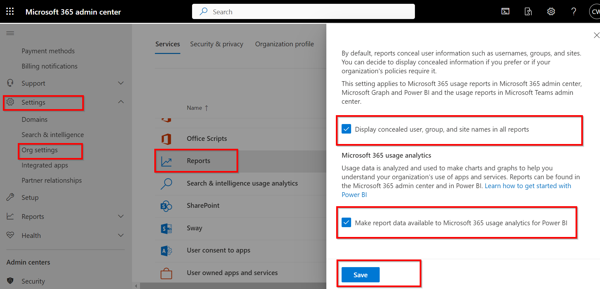
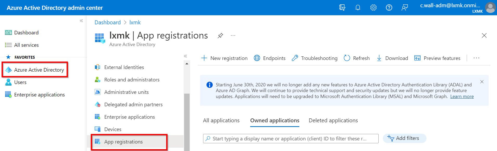

# M365 Usage Reports

## Display Concealed Information

- Navigate to [https://admin.microsoft.com](https://admin.microsoft.com/)
- Click on Setting -> Org Settings -> Reports
- Ensure that that the following options are checked:
  - Display concealed user, groups, and site names ina ll reports
  - Make report data available to Microsoft 365 usage analytics for Power BI
- Save changes.
  


## Certificate

In order to complete the below step for App Registration you will require a certificate. A certificate from a certificate authority is recomended but if you do not have a certificate signed by a certificate authority you can create a self signed certificate as described below. 

- From the project directory exicute the PowerShell script called self_signed.ps1 , this will generate a self signed certificate.

For more information regarding certificates, view the official documentation on the [Microsoft Site](https://learn.microsoft.com/en-us/azure/active-directory/develop/howto-create-self-signed-certificate)


## App Registration

To Authenticate with your tenant an Azure AD App Registration is required, follow the belwo steps to enable App Registration for your tenant:

***Please Note:*** App Registration requires Application permissions for User.Read.All

- Navigate to [Azure Active Directory](https://aad.portal.azure.com/)
- From the portal Select Azure Active Directory and then select App registration
  
- Select New registration. On the Register an application page, set the values as follows
  - Add a name
  - Set Supported account types to Accounts in this organizational directory only.
  - Leave Redirect URI blank.
- Click on Register
- Once the app has been registered, save the ApplicationId and TenantId to the respective fields of the [config.json file](Config/config.json)
- Select API Permissions under Manage. Choose Add a permission.
- Select Microsoft Graph, then Application Permissions. Add User.Read.All and Group.Read.All and Directory.Read.All, then select Add permissions.
- In the Configured permissions, remove the delegated User.Read permission under Microsoft Graph by selecting the ... to the right of the permission and selecting Remove permission. Select Yes, remove to confirm.
- Select the Grant admin consent for... button, then select Yes to grant admin consent for the configured application permissions. The Status column in the Configured permissions table changes to Granted for ....
- Select Certificates & secrets under Manage. Select the Upload certificate button. Browse to your certificate's public key file and select Add.
  - Copy the certificate Thumbprint and save it to the [config.jsone file](Config/config.json)
  - ***Please Note***: The certificate will have an experation date, if the certificate expires an new certificate will be required

## Install the Microsoft Graph PowerShell SDK

For updated information, review the [official documentation](https://learn.microsoft.com/en-us/powershell/microsoftgraph/installation)

Run the below comand as an admin user:

``` PowerShell
Install-Module Microsoft.Graph -Scope AllUsers
```

To verify the modules were installed run:

```PowerShell
Get-InstalledModule Microsoft.Graph
```

Run the below command to validate the installation:

```PowerShell
Get-InstalledModule Microsoft.Graph
```

